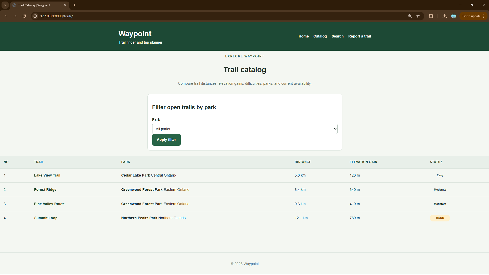
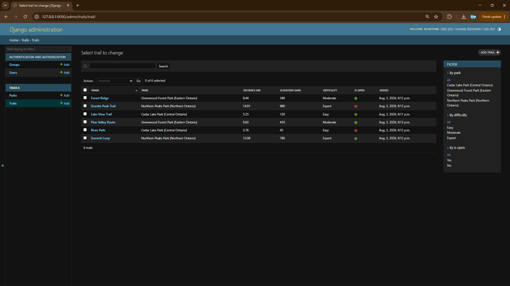

# Waypoint

Waypoint is my individual term project for CCGC-5003 Application Programming.

I began the project as a pure-Python object-oriented trail-planning domain engine and progressively developed it into a Django 4.2 trail-finder website.

The completed project includes object-oriented Python classes, operator overloading, inheritance, polymorphism, mixins, Django templates and forms, database-backed Trail and Park models, ForeignKey relationships, Django administration, trail filtering, a Trail detail page, automated tests, and a documented clone-and-run workflow.

---

## Project status

Waypoint has been developed through Weeks 7–14 of the term project.

The completed project includes:

- A pure-Python object-oriented domain engine
- A validated `Distance` value type
- Trail inheritance and polymorphism
- Mixins and Method Resolution Order demonstrations
- A validated `Itinerary`
- Django 4.2
- Shared Django templates and static CSS
- A homepage
- A trail-report form with CSRF protection
- Safe trail searching
- A database-backed trail catalog
- Django `Trail` and `Park` models
- A required ForeignKey relationship from Trail to Park
- Django administration
- Park-based catalog filtering
- A database-backed Trail detail page
- HTTP 404 handling for missing Trails
- Automated Django and pure-Python tests
- Migration files that apply from a clean database

---

## Technology

I developed and verified the project with:

- Python 3.12
- Django 4.2.30
- SQLite for local development
- HTML
- CSS
- Git
- GitHub
- Windows PowerShell

Python 3.12 is used because it is compatible with the required Django 4.2 release.

---

# Main features

## Pure-Python domain engine

The `waypoint_core` package contains the object-oriented Python portion of Waypoint.

It includes:

- A validated `Distance` class
- Kilometre and mile conversion
- Read-only distance properties
- Distance addition and subtraction
- Distance comparison and sorting
- Mixed-unit arithmetic and comparisons
- An abstract `Trail` base class
- Abstract `estimated_time()` and `summary()` methods
- `DayHike`
- `BackpackingRoute`
- `TrailRun`
- `GuidedDayHike`
- Method overriding
- `super()`
- `ElevationMixin`
- `RatingMixin`
- Method Resolution Order demonstrations
- Polymorphism
- A duck-typed `FakeTrail`
- A validated `Itinerary`
- Independent itinerary trail collections
- Total-distance calculations

---

## Django web application

The Django portion of Waypoint includes:

- A styled homepage
- Shared project-level templates
- Shared static CSS
- Template inheritance
- Reusable navbar and footer partials
- Named URL routes
- A Django trail-report form
- Required-field validation
- Email validation
- CSRF protection
- Personalized report confirmation
- Safe search-query handling
- A database-backed trail catalog
- Park filtering
- Trail detail pages
- HTTP 404 handling for missing Trail IDs
- Django administration

---

# Database models

Waypoint contains two related Django database models.

## Park

A Park contains:

- `name`
- `region`

Example:

```text
Cedar Lake Park (Central Ontario)
```

## Trail

A Trail contains:

- `name`
- `park`
- `distance_km`
- `elevation_gain`
- `difficulty`
- `is_open`
- `added`

Difficulty choices are:

- Easy
- Moderate
- Expert

Every Trail is required to belong to a Park.

---

## Trail-to-Park relationship

The Django `Trail` model contains a ForeignKey to `Park`.

The relationship uses:

```python
on_delete=models.PROTECT
```

I chose `PROTECT` deliberately because a Park should not be deleted while Trail records still depend on it.

This prevents accidental loss of a Park that is being referenced by existing Trails.

The relationship also uses:

```python
related_name="trails"
```

This allows reverse queries such as:

```python
park.trails.all()
```

The final relationship is non-nullable, so every saved Trail must have a Park.

---

# Important Trail class distinction

Waypoint contains two classes named `Trail`, but they have different purposes.

## `waypoint_core.Trail`

This is the pure-Python abstract domain class used for the object-oriented programming portion of the project.

It demonstrates concepts such as:

- Abstraction
- Inheritance
- Polymorphism
- Method overriding
- Operator-related domain behavior

## `trails.models.Trail`

This is the Django ORM database model used by the web application.

It represents Trail records stored in the SQLite database.

Keeping these responsibilities separate lets the project preserve the earlier object-oriented domain engine while also using Django models for persistence.

---

# Database migrations

The `trails` application currently contains these migrations:

```text
0001_initial.py
0002_park_trail_park.py
0003_alter_trail_park.py
```

## `0001_initial.py`

Creates the initial database-backed `Trail` model.

## `0002_park_trail_park.py`

Creates the `Park` model and introduces the Trail-to-Park ForeignKey in a migration-safe way.

The relationship was initially allowed to be nullable so existing Trail rows could be assigned to Parks before making the relationship mandatory.

## `0003_alter_trail_park.py`

Makes the Trail-to-Park ForeignKey non-nullable after existing Trail records have been assigned to valid Parks.

This provides a safe migration path while also enforcing the final rule that every Trail belongs to a Park.

---

# Django administration

Both `Park` and `Trail` are available through Django admin.

The Trail administration page provides information such as:

- Trail name
- Park
- Distance
- Elevation gain
- Difficulty
- Open/closed status
- Date added

Trail records can also be filtered by:

- Park
- Difficulty
- Open/closed status

The Park administration page displays Park names and regions.

Because the Trail ForeignKey uses `PROTECT`, Django prevents an administrator from deleting a Park that still has related Trails.

---

# Trail catalog

The database-backed catalog is available at:

```text
/trails/
```

The catalog:

- Reads Trail records using the Django ORM
- Displays only open Trails
- Orders open Trails by distance
- Displays the related Park for each Trail
- Displays the Park region
- Formats distance values for display
- Uses difficulty/status badges
- Uses automatic template row numbering
- Allows filtering open Trails by Park
- Links each Trail name to its detail page

Closed Trails remain stored in the database and visible to administrators but are not displayed in the public catalog.

---

# Trail detail page

Each public Trail has a detail page using its database ID.

Example:

```text
/trails/1/
```

The detail page displays:

- Trail name
- Park
- Region
- Distance
- Elevation gain
- Difficulty
- Availability

If the requested database ID does not exist, the view returns HTTP:

```text
404 Not Found
```

For example:

```text
/trails/999999/
```

returns a 404 response instead of causing a server error.

---

# Website routes

The main website routes include:

| Route | Purpose |
| --- | --- |
| `/` | Waypoint homepage |
| `/trails/` | Database-backed Trail catalog |
| `/trails/<id>/` | Individual Trail detail page |
| `/search/` | Trail search |
| `/report/` | Trail-report form |
| `/admin/` | Django administration |

Example Trail detail route:

```text
http://127.0.0.1:8000/trails/1/
```

---

# Project structure

```text
waypoint-term-project/
|
|-- docs/
|   `-- screenshots/
|       |-- admin.png
|       `-- catalog.png
|
|-- static/
|   `-- style.css
|
|-- templates/
|   |-- partials/
|   |   |-- footer.html
|   |   `-- navbar.html
|   |-- base.html
|   |-- catalog.html
|   |-- home.html
|   |-- report_form.html
|   |-- report_thanks.html
|   |-- search.html
|   `-- trail_detail.html
|
|-- tests/
|   |-- __init__.py
|   |-- test_distance.py
|   |-- test_distance_operators.py
|   |-- test_itinerary.py
|   |-- test_trail.py
|   `-- test_week8_mixins.py
|
|-- trails/
|   |-- migrations/
|   |   |-- __init__.py
|   |   |-- 0001_initial.py
|   |   |-- 0002_park_trail_park.py
|   |   `-- 0003_alter_trail_park.py
|   |-- __init__.py
|   |-- admin.py
|   |-- apps.py
|   |-- models.py
|   |-- tests.py
|   |-- urls.py
|   `-- views.py
|
|-- waypoint/
|   |-- __init__.py
|   |-- asgi.py
|   |-- forms.py
|   |-- settings.py
|   |-- tests.py
|   |-- urls.py
|   |-- views.py
|   `-- wsgi.py
|
|-- waypoint_core/
|   |-- __init__.py
|   |-- distance.py
|   |-- guided.py
|   |-- itinerary.py
|   |-- mixins.py
|   |-- polymorphism.py
|   `-- trail.py
|
|-- .gitignore
|-- demo_week7.py
|-- demo_week8.py
|-- manage.py
|-- README.md
`-- requirements.txt
```

The following local-development files and folders are intentionally not committed:

```text
env/
db.sqlite3
__pycache__/
```

---

# Setup from a fresh clone

These instructions are written for Windows PowerShell.

A grader can use the following steps to clone the repository, create an isolated Python environment, install the project, build the database, run the tests, and start Waypoint.

## 1. Clone the repository

Open PowerShell and move to the folder where the project should be stored.

Run:

```powershell
git clone https://github.com/achuthanjagandas/waypoint-term-project.git
```

Enter the cloned repository:

```powershell
Set-Location waypoint-term-project
```

---

## 2. Create the virtual environment

Run:

```powershell
py -3.12 -m venv env
```

This creates the required virtual environment named:

```text
env
```

---

## 3. Activate the virtual environment

Run:

```powershell
.\env\Scripts\Activate.ps1
```

After activation, PowerShell should show:

```text
(env)
```

before the command prompt.

### PowerShell execution-policy troubleshooting

If PowerShell reports that `Activate.ps1` cannot be loaded because script execution is disabled, run:

```powershell
Set-ExecutionPolicy -Scope Process -ExecutionPolicy Bypass
```

Then activate the environment again:

```powershell
.\env\Scripts\Activate.ps1
```

The `Process` scope applies only to the current PowerShell session.

---

## 4. Install the dependencies

With `(env)` visible in the terminal, run:

```powershell
python -m pip install -r requirements.txt
```

Verify Django:

```powershell
python -m django --version
```

The project was developed with Django:

```text
4.2.30
```

---

## 5. Verify the pure-Python package

Run:

```powershell
python -c "import waypoint_core; print('waypoint_core import OK')"
```

Expected output:

```text
waypoint_core import OK
```

---

## 6. Apply the database migrations

Run:

```powershell
python manage.py migrate
```

This creates the local SQLite database and applies the Django and Waypoint migration history.

Verify the Trail migrations with:

```powershell
python manage.py showmigrations trails
```

Expected Trail migrations:

```text
[X] 0001_initial
[X] 0002_park_trail_park
[X] 0003_alter_trail_park
```

---

## 7. Check the Django configuration

Run:

```powershell
python manage.py check
```

Expected output:

```text
System check identified no issues (0 silenced).
```

---

## 8. Run the automated tests

Run the complete project test suite:

```powershell
python manage.py test
```

The latest local Week 14 verification completed:

```text
72 tests
OK
```

The pure-Python tests can also be run independently:

```powershell
python -m unittest discover -s tests -v
```

The latest independent pure-Python verification completed:

```text
56 tests
OK
```

---

## 9. Start the development server

Run:

```powershell
python manage.py runserver
```

When the server starts successfully, open:

```text
http://127.0.0.1:8000/
```

The Trail catalog is available at:

```text
http://127.0.0.1:8000/trails/
```

Stop the server with:

```text
Ctrl + C
```

---

# Creating a Django administrator

A fresh clone does not contain my local administrator account because `db.sqlite3` is intentionally excluded from Git.

To create a local administrator, run:

```powershell
python manage.py createsuperuser
```

Follow the prompts to create:

- Username
- Email address, if desired
- Password

Then start the server:

```powershell
python manage.py runserver
```

Open:

```text
http://127.0.0.1:8000/admin/
```

Log in using the superuser account that was just created.

---

# Adding Trail and Park data

Because the SQLite development database is intentionally not committed, a fresh clone begins with an empty Waypoint database after migrations.

A grader can create sample data through Django admin.

Create a superuser:

```powershell
python manage.py createsuperuser
```

Start the server:

```powershell
python manage.py runserver
```

Open:

```text
http://127.0.0.1:8000/admin/
```

Create one or more Parks first.

Example:

```text
Name: Cedar Lake Park
Region: Central Ontario
```

Then create Trails and assign each Trail to a Park.

Example:

```text
Name: Lake View Trail
Park: Cedar Lake Park
Distance km: 5.25
Elevation gain: 120
Difficulty: Easy
Is open: Yes
```

Open Trails will appear in the public Trail catalog.

---

# Report form and CSRF protection

The report form is available at:

```text
/report/
```

The form uses Django's CSRF protection:

```django

```

A valid form submission displays a personalized thank-you page.

Django rejects a POST request without a valid CSRF token to protect the application from cross-site request-forgery attacks.

---

# Search behavior

The search view safely reads the query parameter with:

```python
request.GET.get("q", "")
```

Therefore:

```text
/search/
```

works even when no `q` parameter is supplied.

Example:

```text
/search/?q=lake
```

---

# Estimated-time formulas

The pure-Python Trail subclasses use intentionally simple formulas so their behavior can be explained clearly.

## DayHike

I calculate estimated time using the hiking pace and add additional time for elevation gain.

The elevation adjustment adds approximately one hour for every 600 metres of elevation gain.

---

## BackpackingRoute

I calculate estimated time using the backpacking pace.

I add approximately one hour for every 500 metres of elevation gain and add 30 minutes for each overnight stop.

---

## TrailRun

I calculate estimated time using the running pace.

I add approximately one hour for every 900 metres of elevation gain.

---

## GuidedDayHike

I use the normal `DayHike` estimate and add 30 minutes for a safety briefing.

---

# Mixed-unit Distance policy

When arithmetic or comparisons involve kilometres and miles, I convert the right-hand `Distance` into the left-hand object's unit.

Examples:

```python
Distance(5, "km") + Distance(1, "mi")
```

returns a result measured in kilometres.

```python
Distance(5, "mi") + Distance(1, "km")
```

returns a result measured in miles.

Equality and ordering also convert the right-hand value before comparing.

Subtraction raises `ValueError` when the operation would produce a negative distance.

The `Itinerary` follows the same principle when calculating total distance in a requested unit.

---

# Demonstration programs

The original object-oriented project stages include demonstration programs.

Run the Week 7 demonstration:

```powershell
python demo_week7.py
```

Run the Week 8 demonstration:

```powershell
python demo_week8.py
```

---

# Testing strategy

Waypoint contains both pure-Python unit tests and Django tests.

The test suite covers areas including:

- Distance validation
- Unit conversion
- Operator overloading
- Distance ordering
- Abstract Trail behavior
- Estimated-time behavior
- Mixins
- MRO
- Polymorphism
- Duck typing
- Itinerary validation
- Django views
- Forms
- Shared templates
- Catalog rendering
- Django models
- Park-to-Trail relationships
- Protected deletion
- Required Park relationships
- Open-Trail database queries
- Distance ordering in the catalog
- Park filtering
- Trail detail rendering
- Missing-Trail 404 responses

The complete suite is run with:

```powershell
python manage.py test
```

---

# Screenshots

The final project includes screenshots of the public Trail catalog and Django administration interface.

## Public Trail catalog



## Django administration



---

# Clean-clone verification checklist

For final verification, I use a new folder and perform the project setup without relying on my existing virtual environment or SQLite database.

The verification sequence is:

```powershell
git clone https://github.com/achuthanjagandas/waypoint-term-project.git
Set-Location waypoint-term-project
py -3.12 -m venv env
Set-ExecutionPolicy -Scope Process -ExecutionPolicy Bypass
.\env\Scripts\Activate.ps1
python -m pip install -r requirements.txt
python manage.py migrate
python manage.py check
python manage.py test
python -c "import waypoint_core; print('waypoint_core import OK')"
python manage.py runserver
```

I verify that:

- The repository clones successfully
- The `env` virtual environment can be created
- Dependencies install from `requirements.txt`
- All migrations apply from an empty database
- `waypoint_core` imports successfully
- Django reports no system-check issues
- The automated tests pass
- The development server starts
- The homepage loads
- The public Trail catalog route loads
- `env/` remains untracked
- `db.sqlite3` remains untracked

---

# Git workflow

I developed the project using a separate feature branch for each project week.

The milestone branches include:

```text
week-07-domain-model
week-08-hierarchy-and-operators
week-09-django-setup
week-10-views-urls-forms
week-11-template-language
week-12-orm-and-admin
week-13-relationships-and-foreignkeys
week-14-hardening-and-handoff
```

Completed milestone tags include:

```text
v7
v8
v9
v10
v11
v12
v13
```

The final Week 14 branch is merged through the final pull request before the final `v1.0` release tag is created.

---

# Final verification commands

Before preparing the final release, I run:

```powershell
python manage.py check
```

```powershell
python manage.py test
```

```powershell
python -m unittest discover -s tests -v
```

```powershell
python manage.py makemigrations --check --dry-run
```

```powershell
git diff --check
```

```powershell
git status
```

Expected results include:

```text
System check identified no issues
```

```text
72 tests
OK
```

```text
56 tests
OK
```

```text
No changes detected
```

and a clean Git working tree after all intended files have been committed.

---

# AI-assistance disclosure

I used substantial AI assistance for project planning, implementation guidance, code explanations, test design, documentation, and error troubleshooting.
I personally ran and verified all commands and tests recorded as completed.